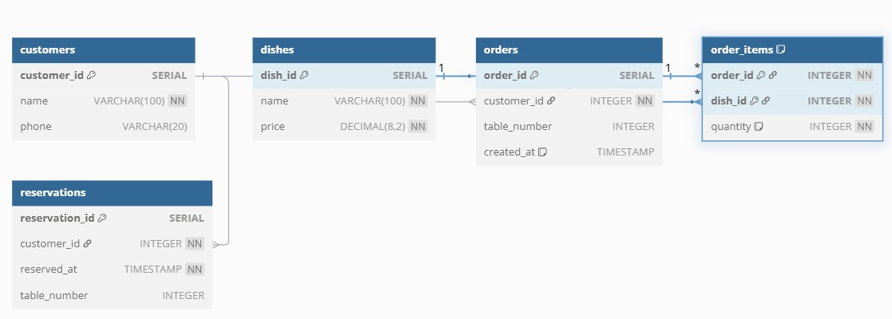
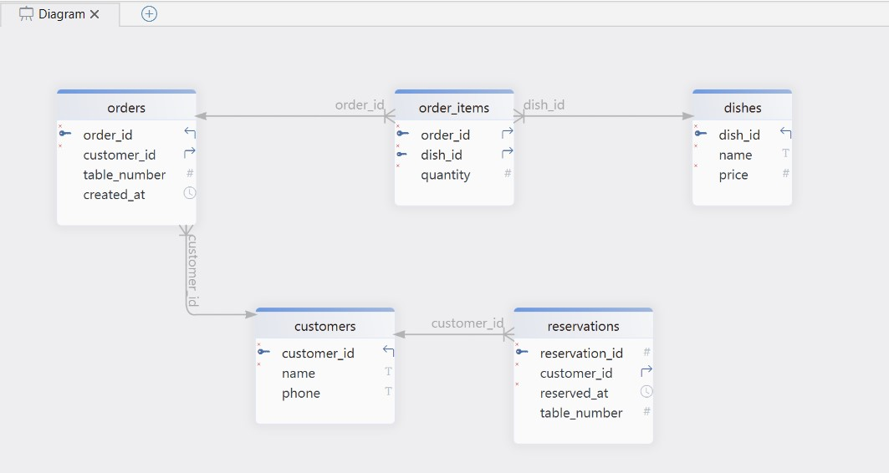
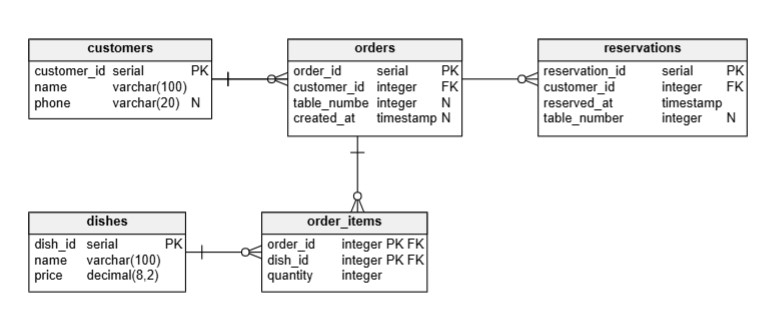

<!--
Задание 1
Создайте схему для некоторой предметной области на ваш выбор (например: ресторан, детский сад, ферма), где у вас будет несколько таблиц. Пусть на ней будут отражены отношения: 1:1, 1:many, many:1, many:many.

Задание 2
Создайте таблицы со своей схемы с помощью SQL, отразите отношения между ними, задав внешние и первичные ключи.
-->

---

## 📁 Задание 1: Строим таблицу с помощью ERD-диаграммы

### 1️⃣ DBdiagram.io



### 2️⃣ DbSchema



### 3️⃣ Vertabelo



---

```sql
-- Customers table
CREATE TABLE customers (
  customer_id SERIAL PRIMARY KEY,    -- PK
  name VARCHAR(100) NOT NULL,        -- Name
  phone VARCHAR(20)                  -- Phone
);

-- Dishes table
CREATE TABLE dishes (
  dish_id SERIAL PRIMARY KEY,        -- PK
  name VARCHAR(100) NOT NULL,        -- Dish name
  price DECIMAL(8,2) NOT NULL        -- Price
);

-- Orders table
CREATE TABLE orders (
  order_id SERIAL PRIMARY KEY,       -- PK
  customer_id INTEGER REFERENCES customers(customer_id), -- FK
  table_number INTEGER,              -- Table number
  created_at TIMESTAMP DEFAULT CURRENT_TIMESTAMP -- Order time
);

-- Order items table (many-to-many join table)
CREATE TABLE order_items (
  order_id INTEGER REFERENCES orders(order_id),    -- FK
  dish_id INTEGER REFERENCES dishes(dish_id),      -- FK
  quantity INTEGER NOT NULL DEFAULT 1,             -- Quantity
  PRIMARY KEY (order_id, dish_id)                  -- Composite PK
);

-- Reservations table
CREATE TABLE reservations (
  reservation_id SERIAL PRIMARY KEY,  -- PK
  customer_id INTEGER REFERENCES customers(customer_id), -- FK
  reserved_at TIMESTAMP NOT NULL,     -- Reservation time
  table_number INTEGER                -- Table number
);
```
